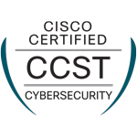

# Hi, I'm Dakota 👋

 

## 👨‍💻 About Me

I'm currently completing my **B.S. in Full-Stack Web Development** at **Arizona State University**.  
By day, I work as a **Server Repair Technician**, and at night I'm either programming, or working on my motorcycles.

Some quick facts:

- 🎓 Studying **full-stack web development** (JavaScript, HTML, CSS, SQL, jQuery, APIs, etc.)
- 💻 Background in **IT and networking** — including hands-on work with servers and infrastructure
- 📡 Earned my **CCNA** and **CCST Cybersecurity**
- 🌐 Member of the **Cisco Live Dream Team**, helping support a large-scale event networks
- 🎯 Career goals: Work in **IT / networking** I'm excited to begin studying for my **Linux +**

---

## 🧰 Tech Stack & Skills

### Languages & Web

- **Frontend:** HTML5, CSS3, JavaScript, jQuery
- **Backend / Data:** SQL, basic REST APIs, JSON, AJAX
- **Other:** Basic Python, Cisco command line tools

### Tools & Platforms

- **Version Control:** Git & GitHub
- **Databases:** SQL Server, ERD design, queries (JOINs, subqueries, etc.)
- **Creative / Media:** Adobe Illustrator, Photoshop, After Effects (motion graphics & UI animations)
- **Systems / IT:** Basic networking, server hardware, troubleshooting

---

## 🚀 What I Like Working On

- Networking: I love creating networks and making them run. I spend an emberassing amount of time working on packet tracers.
- I like using my coding skills to make web based apps for me and my co-workers to help streamline work!
- I like making front-end sites that allow me to flex my graphic design skills.
- 
---

## 📊 A bit about my Github:

---

## 🎯 Current Focus

- Finishing my **B.S. in Full-Stack Web Development**
- Sharpening my **JavaScript**, **SQL**, and **networking** skills
- Building a small portfolio of **practical web tools** and **IT-related projects**
- Exploring roles in **IT support, networking, and junior developer positions**

---

## 📬 Get In Touch

If you'd like to connect, collaborate, or just talk tech:

- 🔗 Send me a message on [LinkedIn](https://www.linkedin.com/in/dakota-sisson/)

Thanks for stopping by! 👋
